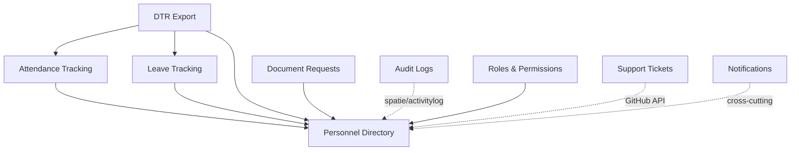

# Contributing to DARPO Albay HR Portal

Welcome to the DARPO Albay HR Portal project! Whether you are a new developer onboarding to the team or an AI agent assisting with the codebase, this document serves as your central guide to setting up and working on the project.

---

## Setting Up Your Development Environment

For the best experience, this project is designed to run in a **Linux environment** (Native Linux, macOS, or Windows WSL2) using Docker and Laravel Sail.

### 1. Prerequisites
- **Docker Engine / Docker Desktop** must be running.
- If you are on Windows, you **MUST** use WSL2 (Ubuntu). Clone the repository inside the Linux filesystem (`~/projects/...`), NOT the Windows filesystem (`/mnt/c/...`), to avoid massive performance penalties.

### 2. Automatic Setup (Recommended)
We provide a comprehensive setup script that builds your environment from scratch:

```bash
# Ensure the script is executable
chmod +x setup.sh

# Run the setup script
./setup.sh
```

The script will automatically:
1. Detect Docker and set up your `.env` file.
2. Install Composer dependencies (via a temporary Docker container if needed).
3. Start Laravel Sail (`./vendor/bin/sail up -d`).
4. Generate the application key, link storage, and run database migrations & seeders.
5. Install NPM dependencies and build frontend assets.
6. Generate typed frontend routes via Laravel Wayfinder.

### 3. Manual Daily Workflow
Once setup is complete, you will use Laravel Sail for day-to-day commands:

```bash
# Start the application
./vendor/bin/sail up -d

# Start the Vite Hot-Module-Replacement (HMR) server for frontend dev
./vendor/bin/sail npm run dev

# Stop the application
./vendor/bin/sail down
```

You can access the local application at `http://localhost`.

---

## Working with AI Agents

If you are an AI agent or a developer leveraging AI coding assistants, you **MUST** read and adhere to the following core context files before making architectural decisions or writing code:

1. **`CODEBASE_SUMMARY.md`**: Contains the full map of the application's modular architecture, routing logic, and existing features. Read this to avoid duplicating existing components or services.
2. **`RULES_AND_GUIDELINES.md`**: Contains strict backend, frontend, security, and migration rules. Key takeaways:
   - Module logic goes in Services, not Controllers.
   - PII fields must be encrypted and redacted from Audit Logs.
   - Never use SQLite syntax (like `LIKE`); we use PostgreSQL (`ILIKE`).
   - Use Laravel Wayfinder for all frontend routing.
3. **`PREMIUM_UI_GUIDE.md`** *(or the UI UX Design Rules in `RULES_AND_GUIDELINES.md`)*: Contains our strict design language (Gestalt principles, dark/light mode parity, interactive hover states, Fitts's law target sizing).

---

## Code Quality & Testing Requirements

Before submitting a Pull Request, you must ensure your code meets our standards. The CI pipeline will reject any code that fails these checks.

### 1. Formatting (Laravel Pint)
We enforce standard Laravel styling via Pint.
```bash
# Run Pint to automatically fix styling issues
./vendor/bin/sail vendor/bin/pint --dirty
```

### 2. Static Analysis (PHPStan)
We use PHPStan at Level 5 to catch type errors and undefined properties. Because PHPStan can be memory-intensive, you may need to run it with a raised limit:
```bash
# Run PHPStan
./vendor/bin/sail php -d memory_limit=2G ./vendor/bin/phpstan analyse
```

### 3. Testing (Pest PHP)
All business logic must be tested using Pest. We use PostgreSQL for testing to match production.
```bash
# Run the test suite
./vendor/bin/sail artisan test --compact
```

---

## Common Pitfalls

These are hard-won lessons from past debugging sessions. Read them before writing code:

| Pitfall | Correct Approach |
| :--- | :--- |
| Using `LIKE` in queries | PostgreSQL requires `ILIKE` for case-insensitive matching. `LIKE` is case-sensitive in Postgres. |
| Arrow functions in `Collection::map()` | PHPStan cannot infer model types through arrow functions on generic collections. Use a standard `function () {}` closure with an inline `/** @var \App\...\Model $item */` annotation. |
| Accessing PII in Audit Logs | Never log raw PII. The `beforeActivityLogged` hook in `AppServiceProvider` auto-redacts sensitive fields. If you add new encrypted fields, add them to the redaction list. |
| PHPStan memory errors | Always run with `php -d memory_limit=2G ./vendor/bin/phpstan analyse`. The default 128MB is insufficient. |
| Nullsafe `?->` on required relations | If a model relation is guaranteed (e.g., `leaveType` on `LeaveRequest`), use `->` not `?->`. PHPStan will flag nullsafe access on non-nullable relations. |
| Hardcoded frontend URLs | Always use Laravel Wayfinder generated functions from `@/actions/` or `@/routes/`. Never hardcode `/api/...` paths. |
| SQLite in tests | Tests **must** run against PostgreSQL to match production. The CI pipeline enforces this. |

## Creating a New Module

If you are tasked with creating a new feature module (e.g., Payroll):
1. Create the module directory: `app/Modules/Payroll/`.
2. Implement standard subdirectories: `Controllers/`, `Models/`, `Requests/`, `Services/`.
3. Create `routes.php` in the module root (it will be auto-registered).
4. Create `navigation.php` if it requires a sidebar link.
5. Create the React frontend pages in `resources/js/pages/Modules/Payroll/`.
6. Assign permissions in `database/seeders/RoleAndPermissionSeeder.php`.

---

## Code Structure & Architecture

This application utilizes a modern, modular tech stack:

*   **Backend:** PHP 8.4 + Laravel 13
*   **Frontend:** React 19 + Inertia.js v3 (SPA architecture)
*   **Styling:** TailwindCSS v4
*   **Database:** PostgreSQL
*   **Type Safety:** Laravel Wayfinder (auto-generates typed routes for frontend)
*   **Testing:** Pest PHP v4
*   **Code Quality:** Laravel Pint (Formatting) & PHPStan (Static Analysis)

### Modular Design (`app/Modules/`)
The backend avoids standard Laravel monolith clutter by grouping features into domain-specific modules. Each module contains its own Controllers, Models, Form Requests, Services, and `routes.php`.

The frontend mimics this structure, with components and pages organized into `resources/js/pages/Modules/`.

---

## Modules & Dependency Tree

The application is composed of several independent but cooperating modules:

1. **Personnel Directory (`app/Modules/Personnel/`)**
   - *Core Entity*. Manages Employees, Divisions, Units, and Positions.
   - *Dependencies*: Relies on Spatie Roles for permission assignment.
2. **Attendance Tracking (`app/Modules/Attendance/`)**
   - Employee clock-in/out and HR manual logging.
   - *Dependencies*: Personnel.
3. **Leave Tracking (`app/Modules/Leave/`)**
   - Digitizes CS Form 6. Tracks Leave Credits, Requests, and Holidays.
   - *Dependencies*: Personnel.
4. **DTR Export (`app/Modules/DTR/`)**
   - Generates CS Form 48 exports from attendance and leave data.
   - *Dependencies*: Attendance, Leave, Personnel.
5. **Document Requests (`app/Modules/DocumentRequests/`)**
   - Allows employees to request CoEs, Service Records, etc., with a full HR processing pipeline.
   - *Dependencies*: Personnel.
6. **Audit Logs (`app/Modules/Audit/`)**
   - Tracks all system events across all modules.
   - *Dependencies*: `spatie/laravel-activitylog`.
7. **Notifications Infrastructure (`app/Modules/Notifications/`)**
   - Cross-cutting service. Any module can dispatch database notifications (e.g., Leave approvals).
8. **Roles & Permissions (`app/Modules/Roles/`)**
   - Manages access control matrices.
9. **Support Tickets (`app/Modules/SupportTickets/`)**
   - GitHub Issue integration for user bug reports.

### Dependency Diagram



*Solid arrows = direct code dependency. Dotted arrows = integration/cross-cutting concern.*

---

## Database Schema Overview

The database uses PostgreSQL exclusively. Key structures include:
- **Users**: Extended with HR data (encrypted PII like Salary, TIN, PhilHealth).
- **Organization**: `divisions`, `units`, `positions` (hierarchical). A `position_user` pivot table allows employees to hold multiple roles (with one primary).
- **Leave Data**: `leave_credits` (balances), `leave_requests` (filed leaves), `holidays`, `tardiness_records`.
- **Attendance**: `attendances` (daily logs with in/out timestamps).
- **Documents**: `document_requests` (json payload of requested forms + status timeline).
- **Audit**: `activity_log` (Spatie table containing attribute-level changes).

*Note: Real-world entities use `SoftDeletes`. Lookup tables use an `is_active` boolean instead of deletion to preserve historical data integrity.*

---

## Scheduled Tasks & Custom Commands

The application relies on Laravel's Task Scheduler (`routes/console.php`) to automate cleanup, synchronization, and notifications. In production, ensure the scheduler is running (Laravel Cloud handles this automatically; on a VPS, configure `* * * * * cd /path-to-your-project && php artisan schedule:run >> /dev/null 2>&1`).

### Scheduled Background Tasks
| Command | Frequency | Purpose |
| :--- | :--- | :--- |
| `support-tickets:sync` | Every 5 Mins | Syncs the status of support tickets directly from the GitHub repository. |
| `notifications:prune` | Daily | Deletes user notifications older than the retention period (1 year). |
| `leave:cleanup-attachments` | Daily | Scans for and removes orphaned or soft-deleted leave request attachments from S3. |
| `document-requests:cleanup-attachments` | Daily | Removes orphaned document request file attachments from S3. |
| `milestones:check-upcoming` | Daily | Checks for upcoming employee milestones (like work anniversaries) and dispatches notifications. |
| `support:clean-deleted-tickets` | Daily | Hard-deletes support tickets that were soft-deleted beyond the grace period. |
| `activitylog:clean` | Weekly | Prunes Spatie activity logs older than the legally mandated retention period. |
| `employees:prune` | Monthly | Hard-deletes archived employee records beyond their retention policy. |
| `leave:sync-holidays` | Yearly (Jan 1) | Auto-populates the upcoming year's standard Philippine holidays. |

### Manual Custom Commands
The system includes utility commands for maintenance and development operations:

*   `php artisan maintenance:clean-orphans`
    *   **Purpose:** Deep-scans the S3 bucket comparing physical files to database records to locate and remove completely orphaned files (avatars, attachments).
    *   **Usage:** Must be run manually. Accepts a `--dry-run` flag to preview deletions safely.
*   `php artisan db:anonymize`
    *   **Purpose:** Scrambles PII (Names, Emails, TINs, Salaries) in a database clone to create a safe testing environment for external developers without exposing real government employee data.
    *   **Usage:** *NEVER RUN THIS ON PRODUCTION.* Use only on isolated local or staging databases.
