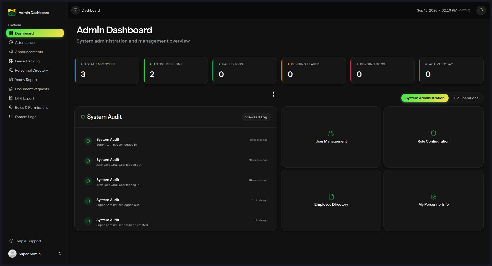
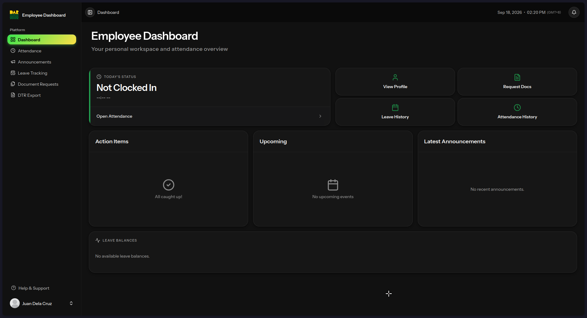
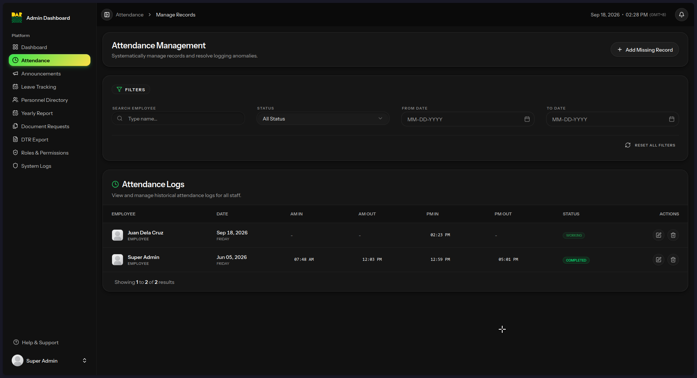
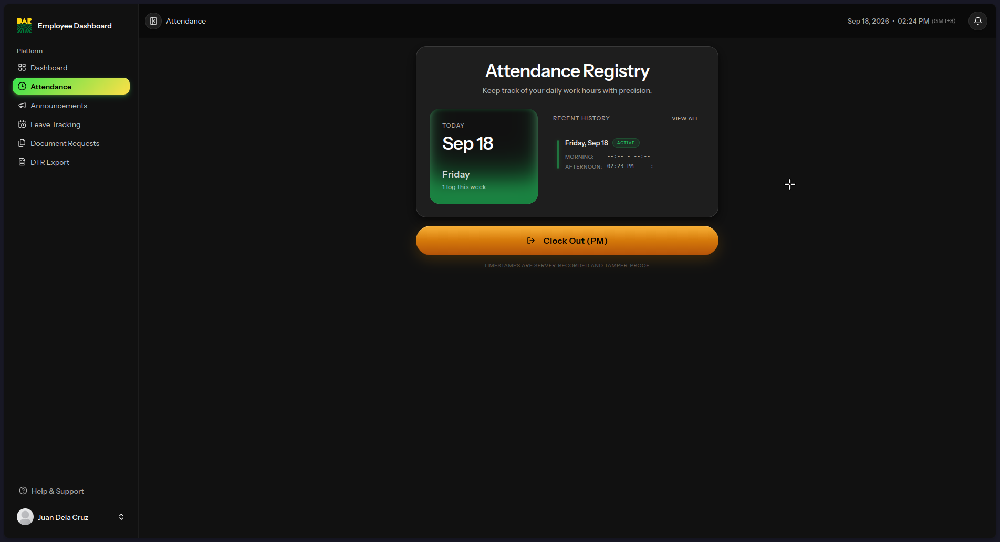
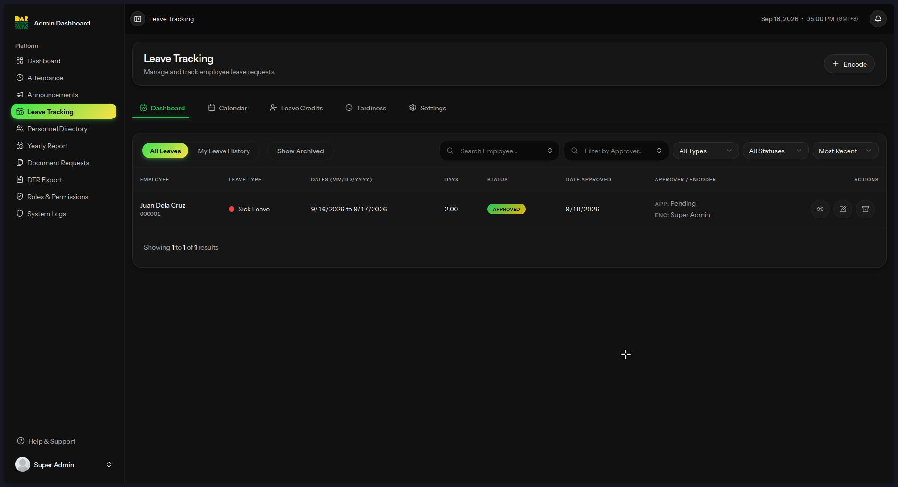
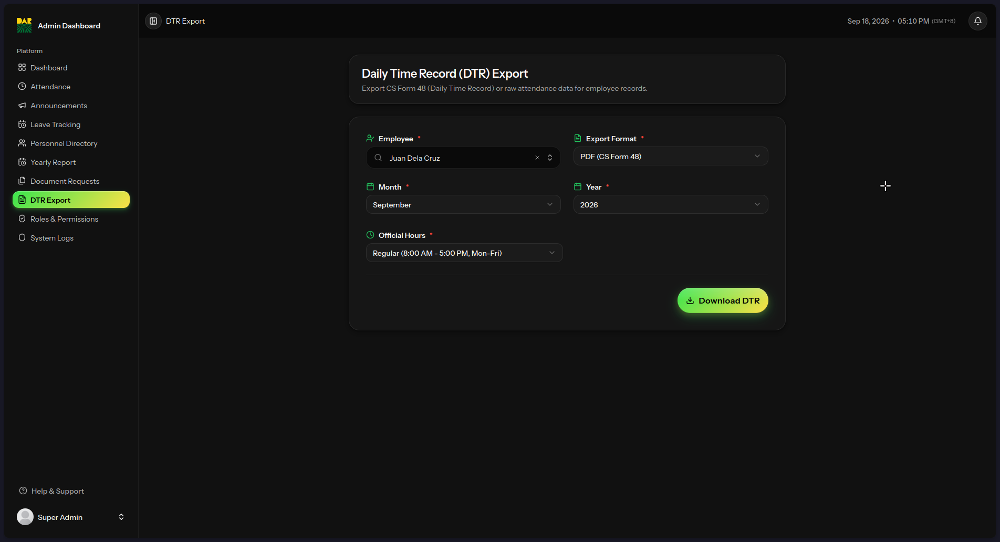
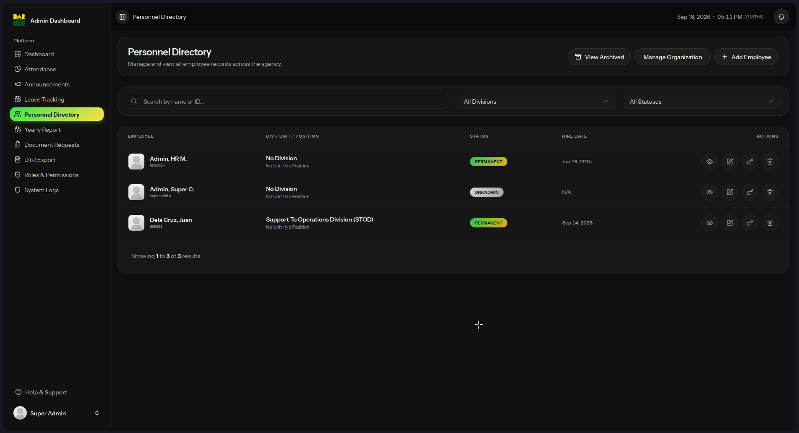
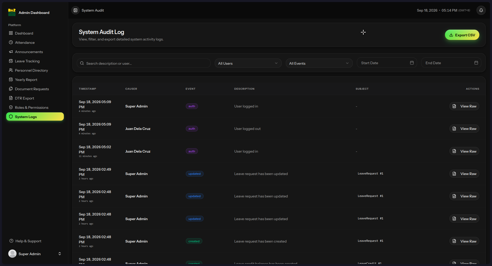

# DARPO Albay HR Portal

A modern, high-performance Human Resource Information System (HRIS) originally built for the Department of Agrarian Reform Provincial Office (DARPO) Albay. This project digitizes core HR operations — attendance tracking, leave management, document requests, and personnel administration — with strict compliance to Philippine civil service regulations.

> **Context:** This system was developed during our internship at DARPO Albay and was designed as a production-grade application for real government HR workflows. The project is no longer under active engagement with the client and now serves as a **portfolio project** showcasing full-stack development with Laravel 13, React 19, and Inertia.js v3 — including Philippine legal compliance (RA 10173, CSC Forms 6 & 48), field-level AES-256 encryption, and role-based access control for 5 distinct user roles.

---

## Tech Stack

| Layer | Technologies |
|:------|:------------|
| **Backend** | PHP 8.4, Laravel 13, Inertia.js v3 |
| **Frontend** | React 19, TypeScript 5.7, Tailwind CSS v4 |
| **Database** | PostgreSQL (Supabase) |
| **Storage** | Supabase Storage (S3-compatible) |
| **Testing** | Pest v4 (150+ tests), Larastan (PHPStan Level 5) |
| **CI/CD** | GitHub Actions → Laravel Cloud |
| **Code Quality** | Laravel Pint, ESLint 9, Prettier 3 |

---

## Key Features

### Modular Architecture
The application uses a custom modular architecture (`app/Modules/`) with 12 domain modules, each encapsulating its own controllers, models, services, form requests, and routes — registered via a central `ModuleRegistry`.

### Core Modules
- **Attendance** — Clock in/out (AM/PM 4-slot), IP tracking, manual adjustment, archiving
- **Leave Management** — Full CSC Form 6 digitization, working-day deduction engine, holiday awareness, credit tracking
- **DTR (Daily Time Record)** — CSC Form 48 PDF/Excel export, compressed workweek support
- **Personnel** — Employee profiles, division/unit hierarchy, salary grade/step computation, promotion tracking
- **Document Requests** — CSC record requests, multi-step approval workflow, digital acknowledgment
- **Announcements** — Draft/publish workflows, division audience targeting, rich text editor
- **Audit** — Spatie activity log explorer with automatic PII redaction
- **Roles & Permissions** — 5-tier RBAC (Super Admin, HR Admin, HR Staff, Division Head, Employee)
- **Support Tickets** — GitHub Issues integration with live thread syncing
- **Yearly Report** — Service milestone anniversaries with Excel export

### Security & Compliance
- **AES-256 field encryption** for all sensitive PII (salary, TIN, GSIS, PhilHealth, HDMF, PRC, bank account numbers)
- **Auto-redaction layer** — encrypted fields are automatically replaced with `[REDACTED]` before writing to audit logs
- **MFA enforcement** for administrative roles with rate-limited login
- **DSAR (Data Subject Access Request)** self-service export for RA 10173 compliance
- **S3 directory traversal prevention** with tested security guards
- **Content Security Policy** headers

---

## Screenshots

### Dashboard & Navigation
*Admin View*


*Employee View*


### Attendance Module
*HR View*


*Employee View*


### Leave Management (CSC Form 6)


### DTR Export (CSC Form 48)


### Personnel Management


### Audit Logs (Compliance)


### Mobile Responsive
https://github.com/user-attachments/assets/f578e060-14e1-40d4-8a72-c2c0215376e7

---

## Project Goals

1. **Digitize HR Operations** — Replace paper-based CS Form 6 (Leave) and CS Form 48 (DTR) with fully auditable digital records
2. **Role-Based Access Control** — Strict data isolation across Super Admins, HR Staff, Division Heads, and Employees
3. **High Performance & Modern UI** — Lightning-fast SPA experience with a premium design
4. **Data Integrity & Auditability** — Full system logs of all critical actions, down to the attribute level

---

## Architecture & Development

Detailed information regarding the system architecture, database schema, modular dependencies, background scheduled tasks, and custom console commands are documented in the **[Contributing Guide](CONTRIBUTING.md)**.

---

## Getting Started

### Prerequisites
- PHP 8.4+
- Node.js 20+
- PostgreSQL 15+
- Composer 2+

### Quick Setup (with Laravel Sail)

```bash
git clone https://github.com/your-username/darpo-albay-hr-portal.git
cd darpo-albay-hr-portal
cp .env.example .env
./setup.sh
```

Or manually:

```bash
composer install
npm install
php artisan key:generate
php artisan migrate --seed
npm run build
php artisan serve
```

### Default Test Accounts

Initial accounts created by the database seeders (`php artisan db:seed`):

| Role | Employee Number | Email | Password |
| :--- | :--- | :--- | :--- |
| **Super Admin** | `superadmin` | `superadmin@example.com` | `password` |
| **HR Admin** | `hradmin` | `hradmin@example.com` | `password` |

> **Note:** No employee accounts are seeded. Employee records must be created manually by logging in as Super Admin or HR Admin through the Personnel module.

---

## Deployment

Deployment is fully automated via GitHub Actions (`.github/workflows/tests.yml`).

1. **CI:** Every push to `main` runs the Pest test suite against a PostgreSQL service container, runs PHPStan, and builds Vite assets.
2. **CD:** If CI passes on `main`, the workflow triggers deployment to **Laravel Cloud**.
3. **Database:** Laravel Cloud connects to a **Supabase PostgreSQL** pooler. The deployment hook runs `php artisan migrate --force`.
4. **Storage:** Avatars and documents are uploaded to **Supabase Storage** (S3-compatible) via Laravel's S3 driver.

### External Services & Required API Keys

| Service | Purpose | Environment Variables |
|:--------|:--------|:---------------------|
| **PostgreSQL** (Supabase) | Database | `DB_HOST`, `DB_USERNAME`, `DB_PASSWORD`, `DB_DATABASE` |
| **Supabase Storage** | S3-compatible file uploads | `AWS_ACCESS_KEY_ID`, `AWS_SECRET_ACCESS_KEY`, `AWS_ENDPOINT`, `AWS_BUCKET` |
| **GitHub API** | Support Tickets integration | `GITHUB_TOKEN`, `GITHUB_REPO` |
| **Laravel Cloud** | Hosting & deployment | Tied to GitHub repo |

---

## Legal & Compliance (Philippines)

As a government HR information system, this application complies with:

1. **Republic Act No. 10173 (Data Privacy Act of 2012)** — AES-256 encryption of all sensitive PII, auto-redaction in audit logs, DSAR self-service export
2. **CSC Omnibus Rules on Leave (Rule XVI)** — Full digitization of CS Form No. 6 with automated working-day calculation, holiday awareness, and credit tracking
3. **CSC Memorandum Circular No. 21, s. 1991** — Digitization of CS Form No. 48 (Daily Time Record) with server-side timestamps and official PDF layout export
4. **Republic Act No. 11032 (Ease of Doing Business Act)** — Streamlined document request workflows with status tracking and transparency

---

## Future Roadmap

1. **Biometric Integration** — API endpoints for local biometric scanners (ZKTeco, etc.) to push clock-in/out data directly
2. **Dedicated Queue Workers** — Transition to Laravel Horizon backed by Redis for email notifications and PDF generation at scale
3. **Database Read Replicas** — Offload heavy DTR report generation and audit log queries
4. **Caching Layer** — Redis-backed caching for static computations like organizational chart structure

---

## License

MIT License — see [LICENSE](LICENSE) for details.

Copyright © 2026 Mark Kenneth S. Nudo, Allan Paul A. Sodsod II, Mauve C. Labalan.
